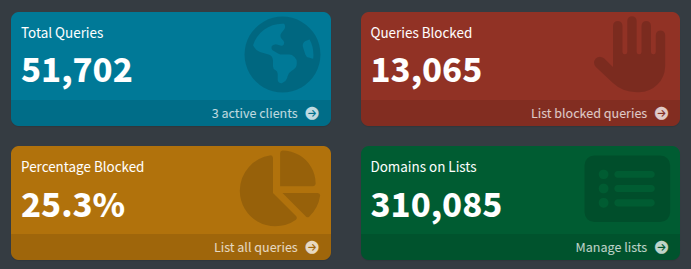
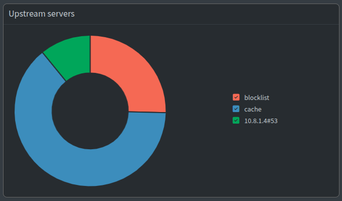

I recently started running pihole, unbound, and wireguard together on my home network. I wanted each service to run in a separate container, but that presented some issues with network interactions between the services. This post is a guide to show how I set it up.
## Background of these services

[Pihole](https://pi-hole.net/) is an ad-blocking service that was built specifically to run on the Raspberry Pi. It acts as a DNS server that forwards requests to an upstream DNS resolver. If it recognizes a domain as an ad domain, it will block the request before forwarding it. It also maintains a cache of DNS requests that it can return without forwarding. I'm always surprised how few requests actually make it to the resolver (10.8.1.4):





[Unbound](https://www.nlnetlabs.nl/projects/unbound/about/) is the second piece of the puzzle. Normally, clients requests a third-party DNS service like Cloudflare or Google to resolve DNS requests. The owners of the DNS servers you request have the ability to associate you with every site you connect to and store that data indefinitely. This doesn't mean they do store that data, _but they may and you need to trust whatever their policy says_. Unbound resolves these DNS requests locally and requests the authoritative nameservers directly, cutting out the need for a middleman.

Finally, [wireguard](https://www.wireguard.com/) is a VPN. I put all my personal devices and the pi on it so I can access these services even when I'm not on my home LAN, without exposing public ports on my router.

This guide will break down setting up each service into its own step. This is a different order than I took when I set this up, but is more logical for wanting all three of these services at the same time from scratch.
## Prerequisites
While not impossible, it will be pretty difficult to set this up without admin access to your router / the ability to reserve an IP address for a device, and this guide will assume you have both of these abilities. Navigate to your router's admin page and reserve a static IP address for your pi. Static IP reservation is a differrun ent process depending on the router you have, so I can't tell you exactly how to do that.

If your ISP changes your public IP every couple days (like most do), you will need a way for your devices to stay up-to-date with what that public IP is. The easiest way is to buy a domain which resolves to your public IP, then update that DNS record whenever your IP changes. You can use [Cloudflare](https://www.cloudflare.com/domains/) to manage the domain, and run something like [ddclient](https://github.com/ddclient/ddclient) on the host to check for public IP changes.

## Step 1: Unbound
The image I used here is [mvance/unbound-rpi](https://hub.docker.com/r/mvance/unbound-rpi). Put this in your docker-compose.yml:

```yaml
  unbound:
    <<: *restart-policy # in my larger docker-compose file, this just expands to restart: unless-stopped
    image: mvance/unbound-rpi
    container_name: unbound
    volumes:
      - /dev/urandom:/opt/unbound/etc/unbound/dev/urandom
      - /dev/random:/opt/unbound/etc/unbound/dev/random
      - /home/dubs/unbound/forward-records.conf:/opt/unbound/etc/unbound/forward-records.conf # this mount is optional; see below
    networks:
      wg:
        ipv4_address: 10.8.1.4
```

At some point, you'll also need to set up a network for pihole, unbound, and wireguard to talk to each other on. It's worth doing this now- append this to your docker-compose.yml:

```yaml
networks:
  wg:
    ipam:
      config:
        - subnet: 10.8.1.0/24
```

By default, this image forwards requests to Cloudflare. If you don't like that, you can configure it to resolve everything locally by blanking out forward-records.conf:

```bash
mkdir unbound
touch unbound/forward-records.conf
```

To test that unbound is correctly working, you can run this command, which spins up an alpine container on the wg network and attempts to resolve a DNS request through unbound:

```shell
docker run --rm --network dubs_wg alpine sh -c "apk add bind-tools && dig +short @10.8.1.4 example.com"
```

You should see the IP addresses that `example.com` resolves to.

Note that my user here is `dubs` and your network name will probably be different!

## Step 2: Pihole

Pihole has an official [Docker image](https://hub.docker.com/r/pihole/pihole/), so I just built from that. Follow from the guide for Docker compose in the repository:

```yaml
  pihole:
    <<: *restart-policy
    image: pihole/pihole
    container_name: pihole
    ports:
      # dns ports
      - "53:53/tcp"
      - "53:53/udp"
      # use secondary http/https port since nginx (running on host) gets 80 and 443
      - "8080:80/tcp"
      - "8443:443/tcp"
    environment:
      TZ: "America/New_York"
      FTLCONF_webserver_api_password: "${PIHOLE_ADMIN_PASSWORD}"
      FTLCONF_dns_listeningMode: "ALL"
      # FTLCONF_dns_interface: "eth0"
    volumes:
      - ./etc-pihole:/etc/pihole
    cap_add:
      - SYS_NICE
      - SYS_TIME
    networks:
      wg:
        ipv4_address: 10.8.1.3
```

Important notes here:
- Pihole has three settings for interfaces it listens on: only local devices, an interface you specify, or all interfaces. I want pihole to serve both devices on my LAN (that aren't necessarily connected to the VPN) and wireguard devices, so I set `FTLCONF_dns_listeningMode` to `ALL`. Update this and `FTLCONF_dns_interface` accordingly if your setup differs.
- This requires you to `mkdir etc-pihole` for persisting settings and state
- I recommend setting `PIHOLE_ADMIN_PASSWORD` as an environment variable (I put mine in `~/.bashenv`) so you don't have to reset the password every time you restart the container.

Create the container with `docker compose up pihole -d`\[1], then navigate to the admin dashboard at `http://YOUR_PI_IP:8080/admin`. Go to Settings > DNS > Expert mode, then disable any checked "Upstream DNS Servers" and add this line to the "Custom DNS servers" text box:

```
unbound#53
```

This tells pihole to hit port 53 on the unbound container for _all_ DNS requests. Fun fact: Docker will resolve the hostname `unbound` to its wg IP automatically!

While you're here, you should set up your blocklists. I use 2:
- https://raw.githubusercontent.com/StevenBlack/hosts/master/hosts
- https://cdn.jsdelivr.net/gh/hagezi/dns-blocklists@latest/adblock/pro.txt
Add these in Lists > Add blocklist.

Now, you can test resolving DNS using pihole's IP:

```shell
docker run --rm --network dubs_wg alpine sh -c "apk add bind-tools && dig +short @10.8.1.3 example.com"
```


\[1] From what I remember, there may be a setup wizard for pihole; if there is, choosing the defaults should be ok.

## Step 3: Wireguard
I used [wg-easy](https://github.com/wg-easy/wg-easy) as the image for wireguard, because it came with a friendly web UI for managing peers that I liked. Note that if your machine doesn't support legacy iptables, then building from the Dockerfile in that repo will error on these two lines:

```dockerfile
# Use iptables-legacy
RUN update-alternatives --install /usr/sbin/iptables iptables /usr/sbin/iptables-legacy 10 --slave /usr/sbin/iptables-restore iptables-restore /usr/sbin/iptables-legacy-restore --slave /usr/sbin/iptables-save iptables-save /usr/sbin/iptables-legacy-save
RUN update-alternatives --install /usr/sbin/ip6tables ip6tables /usr/sbin/ip6tables-legacy 10 --slave /usr/sbin/ip6tables-restore ip6tables-restore /usr/sbin/ip6tables-legacy-restore --slave /usr/sbin/ip6tables-save ip6tables-save /usr/sbin/ip6tables-legacy-save
```

As the comments in [this issue](https://github.com/wg-easy/wg-easy/issues/2220) note, you can just comment these lines out and it should work fine - I just built the image like this and called it `wg-easy-fixed`. Here's what I have in my docker-compose.yml:

```yaml
  wg-easy:
    <<: *restart-policy
    environment:
      - INSECURE=true
    image: wg-easy-fixed
    container_name: wg-easy
    volumes:
      - etc_wireguard:/etc/wireguard
      - /lib/modules:/lib/modules:ro
    ports:
      - "51820:51820/udp" # the actual vpn tunnel
      - "51821:51821/tcp" # the admin dashboard
    cap_add:
      - NET_ADMIN
      - SYS_MODULE
    sysctls:
      - net.ipv4.ip_forward=1
      - net.ipv4.conf.all.src_valid_mark=1
    networks:
      wg:
        ipv4_address: 10.8.1.2
```

To access the VPN from outside the home network, you'll have to forward port 51820 on your router to port 51820 on your pi.

`docker compose up wg-easy -d` to start the container \[2], then go to the admin dashboard at `http:/YOUR_PI_IP:51820`. Click Admin Panel > Config, make sure the Host is set to your router's public IP (or your domain, if you went that route) and set DNS to 10.8.0.3 (the docker IP address of pihole). Then, create new clients and set up the VPN on any devices you want connected. This can vary device to device, but for me:
- On my laptop running Ubuntu, I downloaded the .conf file from the admin UI and copied it to `/etc/wireguard/wg0.conf`, then I set up the interface using the `wg-quick` command-line tool.
- On my Android phone, I downloaded the Wireguard app from the Google Play Store and scanned the QR code.

Depending on how the OS handles multiple DNS resolvers, you can add a backup DNS server here if you'd like. Personally, I have `1.1.1.1` (Cloudflare) as a backup on my laptop, which it falls back to if pihole takes too long. On my phone, I only go through pihole because I noticed that Android doesn't prioritize the first server when you give multiple IPs.

If all is well, when the VPN is enabled you should be able to:
- Go on a different network than your home LAN (e.g., if on your laptop, your phone's hotspot)
- Request a domain and see the request logged in pihole's dashboard

If you can do that: congratulations! You have successfully set up wireguard, pihole, and unbound.

\[2] There might be another setup wizard here as well? The important one is to set the host to your router's public IP.

